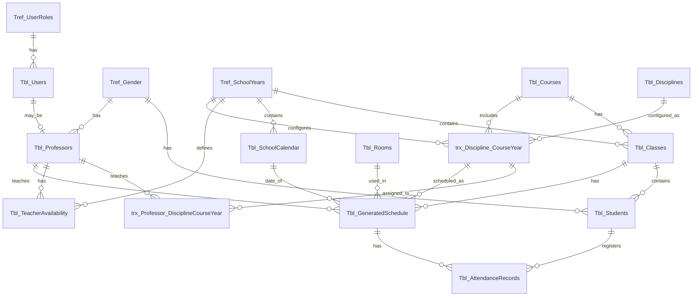

# Academia360 ER Diagram

This document describes the Entity Relationship Diagram of the Academia360 database.

The database is organized using three table prefixes:

| Prefix | Meaning | Example |
|---|---|---|
| `Tbl_` | Main data table | `Tbl_Students` |
| `Tref_` | Reference table / fixed list | `Tref_UserRoles` |
| `trx_` | Relationship table | `trx_Discipline_CourseYear` |

---

## 1. Main Relationships Overview

```text
Tref_UserRoles 1 ─── N Tbl_Users

Tbl_Users 1 ─── 0..1 Tbl_Professors

Tref_Gender 1 ─── N Tbl_Students
Tref_Gender 1 ─── N Tbl_Professors

Tref_SchoolYears 1 ─── N Tbl_Classes
Tref_SchoolYears 1 ─── N Tbl_SchoolCalendar
Tref_SchoolYears 1 ─── N Tbl_TeacherAvailability
Tref_SchoolYears 1 ─── N trx_Discipline_CourseYear

Tbl_Courses 1 ─── N Tbl_Classes
Tbl_Courses 1 ─── N trx_Discipline_CourseYear

Tbl_Classes 1 ─── N Tbl_Students
Tbl_Classes 1 ─── N Tbl_GeneratedSchedule

Tbl_Disciplines 1 ─── N trx_Discipline_CourseYear

trx_Discipline_CourseYear 1 ─── N Tbl_GeneratedSchedule

Tbl_Professors N ─── N trx_Discipline_CourseYear
through trx_Professor_DisciplineCourseYear

Tbl_Professors 1 ─── N Tbl_TeacherAvailability
Tbl_Professors 1 ─── N Tbl_GeneratedSchedule

Tbl_Rooms 1 ─── N Tbl_GeneratedSchedule

Tbl_SchoolCalendar 1 ─── N Tbl_GeneratedSchedule

Tbl_GeneratedSchedule 1 ─── N Tbl_AttendanceRecords

Tbl_Students 1 ─── N Tbl_AttendanceRecords
```

---

## 2. Mermaid ER Diagram



---

## 3. Reference Tables

Reference tables store controlled lists of values used by other tables.

---

### 3.1. `Tref_UserRoles`

Stores the available user roles in the system.

```text
Tref_UserRoles
├── RoleID PK
├── Name
├── InsertUsername
├── InsertDate
├── ChangeUsername
└── ChangeDate
```

Example values:

```text
admin
director
secretary
professor
```

Relationship:

```text
Tref_UserRoles 1 ─── N Tbl_Users
```

---

### 3.2. `Tref_Gender`

Stores gender reference values.

```text
Tref_Gender
├── GenderID PK
├── Name
├── InsertUsername
├── InsertDate
├── ChangeUsername
└── ChangeDate
```

Example values:

```text
Male
Female
Other
```

Relationships:

```text
Tref_Gender 1 ─── N Tbl_Students
Tref_Gender 1 ─── N Tbl_Professors
```

---

### 3.3. `Tref_SchoolYears`

Stores school years.

```text
Tref_SchoolYears
├── SchoolYearID PK
├── Name
├── StartDate
├── EndDate
├── InsertUsername
├── InsertDate
├── ChangeUsername
└── ChangeDate
```

Example value:

```text
2025/2026
```

Relationships:

```text
Tref_SchoolYears 1 ─── N Tbl_Classes
Tref_SchoolYears 1 ─── N Tbl_SchoolCalendar
Tref_SchoolYears 1 ─── N Tbl_TeacherAvailability
Tref_SchoolYears 1 ─── N trx_Discipline_CourseYear
```

---

## 4. Main Data Tables

---

### 4.1. `Tbl_Users`

Stores users who can authenticate into the system.

```text
Tbl_Users
├── UserID PK
├── FullName
├── Email
├── PasswordHash
├── RoleID FK
├── InsertUsername
├── InsertDate
├── ChangeUsername
└── ChangeDate
```

Relationships:

```text
Tref_UserRoles 1 ─── N Tbl_Users
Tbl_Users 1 ─── 0..1 Tbl_Professors
```

Important note:

The professor's name and email are stored in `Tbl_Users`, not in `Tbl_Professors`.

---

### 4.2. `Tbl_Courses`

Stores training programmes.

```text
Tbl_Courses
├── CourseID PK
├── Code
├── Name
├── InsertUsername
├── InsertDate
├── ChangeUsername
└── ChangeDate
```

Example values:

```text
TGEI
TGPSI
TCIB
```

Relationships:

```text
Tbl_Courses 1 ─── N Tbl_Classes
Tbl_Courses 1 ─── N trx_Discipline_CourseYear
```

---

### 4.3. `Tbl_Classes`

Stores student groups for a specific course and school year.

```text
Tbl_Classes
├── ClassID PK
├── Name
├── CourseID FK
├── SchoolYearID FK
├── CourseYearNumber
├── InsertUsername
├── InsertDate
├── ChangeUsername
└── ChangeDate
```

Example values:

```text
TGEI 1A
TGEI 2A
TGPSI 1A
TCIB 2A
```

Relationships:

```text
Tbl_Courses 1 ─── N Tbl_Classes
Tref_SchoolYears 1 ─── N Tbl_Classes
Tbl_Classes 1 ─── N Tbl_Students
Tbl_Classes 1 ─── N Tbl_GeneratedSchedule
```

---

### 4.4. `Tbl_Students`

Stores student information.

```text
Tbl_Students
├── StudentID PK
├── FullName
├── StudentNumber
├── CardUID
├── ClassID FK
├── PhotoPath
├── GenderID FK
├── Address
├── PostalCode
├── City
├── Contact
├── DateOfBirth
├── InsertUsername
├── InsertDate
├── ChangeUsername
└── ChangeDate
```

Relationships:

```text
Tbl_Classes 1 ─── N Tbl_Students
Tref_Gender 1 ─── N Tbl_Students
Tbl_Students 1 ─── N Tbl_AttendanceRecords
```

---

### 4.5. `Tbl_Professors`

Stores professor-specific information.

```text
Tbl_Professors
├── ProfessorID PK
├── UserID FK
├── PhotoPath
├── GenderID FK
├── Address
├── PostalCode
├── City
├── Contact
├── DateOfBirth
├── InsertUsername
├── InsertDate
├── ChangeUsername
└── ChangeDate
```

Relationships:

```text
Tbl_Users 1 ─── 0..1 Tbl_Professors
Tref_Gender 1 ─── N Tbl_Professors
Tbl_Professors 1 ─── N Tbl_TeacherAvailability
Tbl_Professors 1 ─── N Tbl_GeneratedSchedule
Tbl_Professors N ─── N trx_Discipline_CourseYear through trx_Professor_DisciplineCourseYear
```

Important note:

`Tbl_Professors` does not store `FullName` or `Email`. These fields are stored in `Tbl_Users`.

---

### 4.6. `Tbl_Disciplines`

Stores the general discipline catalogue.

```text
Tbl_Disciplines
├── DisciplineID PK
├── Name
├── Code
├── InsertUsername
├── InsertDate
├── ChangeUsername
└── ChangeDate
```

Example values:

```text
Programming
Networks
Databases
Operating Systems
Mathematics
```

Relationship:

```text
Tbl_Disciplines 1 ─── N trx_Discipline_CourseYear
```

Important note:

The workload of a discipline is not stored in `Tbl_Disciplines`. It is stored in `trx_Discipline_CourseYear`.

---

### 4.7. `Tbl_Rooms`

Stores school rooms.

```text
Tbl_Rooms
├── RoomID PK
├── Name
├── Capacity
├── IsPracticeRoom
├── Location
├── InsertUsername
├── InsertDate
├── ChangeUsername
└── ChangeDate
```

Relationships:

```text
Tbl_Rooms 1 ─── N Tbl_GeneratedSchedule
```

---

### 4.8. `Tbl_SchoolCalendar`

Stores school calendar dates.

```text
Tbl_SchoolCalendar
├── CalendarID PK
├── SchoolYearID FK
├── CalendarDate
├── IsSchoolDay
├── Description
├── InsertUsername
├── InsertDate
├── ChangeUsername
└── ChangeDate
```

Example values:

```text
2025-09-15 | School day
2025-12-25 | Holiday
2026-01-01 | Holiday
```

Relationships:

```text
Tref_SchoolYears 1 ─── N Tbl_SchoolCalendar
Tbl_SchoolCalendar 1 ─── N Tbl_GeneratedSchedule
```

---

### 4.9. `Tbl_TeacherAvailability`

Stores teacher availability by school year.

```text
Tbl_TeacherAvailability
├── TeacherAvailabilityID PK
├── ProfessorID FK
├── SchoolYearID FK
├── DayOfWeek
├── StartTime
├── EndTime
├── InsertUsername
├── InsertDate
├── ChangeUsername
└── ChangeDate
```

Relationships:

```text
Tbl_Professors 1 ─── N Tbl_TeacherAvailability
Tref_SchoolYears 1 ─── N Tbl_TeacherAvailability
```

---

### 4.10. `Tbl_GeneratedSchedule`

Stores generated or manually created schedule records.

```text
Tbl_GeneratedSchedule
├── ScheduleID PK
├── ClassID FK
├── DisciplineCourseYearID FK
├── ProfessorID FK
├── RoomID FK
├── CalendarID FK
├── StartTime
├── EndTime
├── Status
├── InsertUsername
├── InsertDate
├── ChangeUsername
└── ChangeDate
```

Relationships:

```text
Tbl_Classes 1 ─── N Tbl_GeneratedSchedule
trx_Discipline_CourseYear 1 ─── N Tbl_GeneratedSchedule
Tbl_Professors 1 ─── N Tbl_GeneratedSchedule
Tbl_Rooms 1 ─── N Tbl_GeneratedSchedule
Tbl_SchoolCalendar 1 ─── N Tbl_GeneratedSchedule
Tbl_GeneratedSchedule 1 ─── N Tbl_AttendanceRecords
```

Important note:

`Tbl_GeneratedSchedule` uses `DisciplineCourseYearID`, not `DisciplineID`.

This allows the schedule to reference the exact discipline configuration for a specific course and school year.

---

### 4.11. `Tbl_AttendanceRecords`

Stores student attendance punches.

```text
Tbl_AttendanceRecords
├── AttendanceRecordID PK
├── StudentID FK
├── ScheduleID FK
├── PunchType
├── PunchMethod
├── PunchTime
├── IsSynced
├── InsertUsername
├── InsertDate
├── ChangeUsername
└── ChangeDate
```

Relationships:

```text
Tbl_Students 1 ─── N Tbl_AttendanceRecords
Tbl_GeneratedSchedule 1 ─── N Tbl_AttendanceRecords
```

---

## 5. Relationship Tables

---

### 5.1. `trx_Discipline_CourseYear`

Stores the workload configuration of a discipline for a specific course and school year.

```text
trx_Discipline_CourseYear
├── DisciplineCourseYearID PK
├── DisciplineID FK
├── CourseID FK
├── SchoolYearID FK
├── CourseYearNumber
├── TotalMinutes
├── LessonDurationMinutes
├── IsPractical
├── InsertUsername
├── InsertDate
├── ChangeUsername
└── ChangeDate
```

Example:

```text
Programming
Course: TGEI
School year: 2025/2026
Course year number: 1
Total minutes: 7200
Lesson duration: 60
Practical: true
```

Relationships:

```text
Tbl_Disciplines 1 ─── N trx_Discipline_CourseYear
Tbl_Courses 1 ─── N trx_Discipline_CourseYear
Tref_SchoolYears 1 ─── N trx_Discipline_CourseYear
trx_Discipline_CourseYear 1 ─── N Tbl_GeneratedSchedule
trx_Discipline_CourseYear N ─── N Tbl_Professors through trx_Professor_DisciplineCourseYear
```

---

### 5.2. `trx_Professor_DisciplineCourseYear`

Assigns professors to specific discipline-course-year records.

```text
trx_Professor_DisciplineCourseYear
├── ProfessorID PK FK
├── DisciplineCourseYearID PK FK
├── InsertUsername
├── InsertDate
├── ChangeUsername
└── ChangeDate
```

Example:

```text
Professor: Miguel Ramos
Discipline configuration: Programming - TGEI - 2025/2026 - Year 1
```

Relationships:

```text
Tbl_Professors 1 ─── N trx_Professor_DisciplineCourseYear
trx_Discipline_CourseYear 1 ─── N trx_Professor_DisciplineCourseYear
```

---

## 6. Design Decisions

---

### 6.1. Users and Professors Are Separated

`Tbl_Users` stores authentication and identity information:

```text
FullName
Email
PasswordHash
RoleID
```

`Tbl_Professors` stores professor-specific personal information:

```text
UserID
PhotoPath
GenderID
Address
PostalCode
City
Contact
DateOfBirth
```

This avoids duplicating name and email in both tables.

---

### 6.2. Courses and Classes Are Separated

A course represents the general training programme.

A class represents a specific group of students in a course and school year.

Example:

```text
Course: TGEI
Class: TGEI 1A
School year: 2025/2026
Course year number: 1
```

---

### 6.3. Disciplines and Workload Are Separated

`Tbl_Disciplines` stores the general discipline catalogue.

`trx_Discipline_CourseYear` stores the workload configuration.

This is necessary because the same discipline can have different workloads depending on the course and school year.

Example:

```text
Programming in TGEI Year 1 may have 7200 minutes.
Programming in TGPSI Year 1 may have 8400 minutes.
```

---

### 6.4. Schedule Uses `DisciplineCourseYearID`

`Tbl_GeneratedSchedule` does not reference `Tbl_Disciplines` directly.

It references `trx_Discipline_CourseYear`.

This makes the schedule more precise because it knows:

- The discipline
- The course
- The school year
- The course year number
- The workload
- Whether the discipline is practical or not

---

### 6.5. Schedule Uses `CalendarID`

`Tbl_GeneratedSchedule` references `Tbl_SchoolCalendar`.

This allows the backend to validate whether a date is a school day before creating a schedule record.

---

## 7. Schedule Validation Rules

Before creating or updating a schedule record, the backend validates:

- The class exists.
- The discipline course year record exists.
- The professor exists.
- The room exists.
- The calendar date exists.
- The calendar date is a school day.
- The class course matches the discipline course.
- The class school year matches the discipline school year.
- The class course year number matches the discipline course year number.
- The professor is assigned to the selected discipline course year.
- Practical disciplines are scheduled in practice rooms.
- A class cannot have overlapping lessons.
- A professor cannot have overlapping lessons.
- A room cannot have overlapping lessons.

---

## 8. Attendance Model

Attendance records are connected to students and optionally to schedule records.

Each attendance record stores:

```text
StudentID
ScheduleID
PunchType
PunchMethod
PunchTime
IsSynced
```

Allowed `PunchType` values:

```text
in
out
```

Allowed `PunchMethod` values:

```text
nfc
rfid
qr
barcode
manual
```

---

## 9. Final Model Summary

The current model supports:

- Role-based users
- Professors linked to users
- Students linked to classes
- Classes linked to courses and school years
- Disciplines separated from workload configuration
- Professors assigned to specific discipline-course-year records
- Rooms with practical-room support
- School calendar with school-day validation
- Teacher availability by school year
- Schedule records with conflict validation
- Attendance records linked to students and schedules

This structure provides a solid foundation for the next major step: automatic schedule generation.