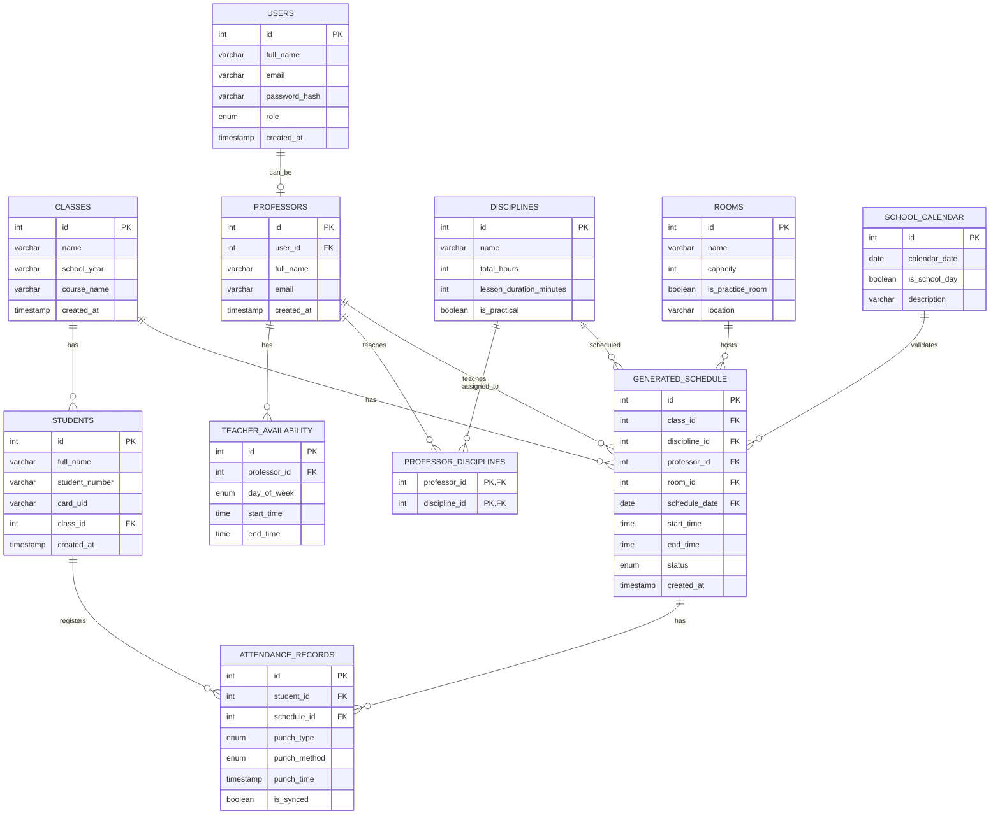

# Academia360 Entity Relationship Diagram

This document contains the initial Entity Relationship Diagram for the Academia360 MySQL database.

```mermaid
erDiagram
    USERS {
        int id PK
        varchar full_name
        varchar email
        varchar password_hash
        enum role
        timestamp created_at
    }

    CLASSES {
        int id PK
        varchar name
        varchar school_year
        varchar course_name
        timestamp created_at
    }

    STUDENTS {
        int id PK
        varchar full_name
        varchar student_number
        varchar card_uid
        int class_id FK
        timestamp created_at
    }

    PROFESSORS {
        int id PK
        int user_id FK
        varchar full_name
        varchar email
        timestamp created_at
    }

    DISCIPLINES {
        int id PK
        varchar name
        int total_hours
        int lesson_duration_minutes
        boolean is_practical
    }

    PROFESSOR_DISCIPLINES {
        int professor_id PK, FK
        int discipline_id PK, FK
    }

    ROOMS {
        int id PK
        varchar name
        int capacity
        boolean is_practice_room
        varchar location
    }

    SCHOOL_CALENDAR {
        int id PK
        date calendar_date
        boolean is_school_day
        varchar description
    }

    TEACHER_AVAILABILITY {
        int id PK
        int professor_id FK
        enum day_of_week
        time start_time
        time end_time
    }

    GENERATED_SCHEDULE {
        int id PK
        int class_id FK
        int discipline_id FK
        int professor_id FK
        int room_id FK
        date schedule_date FK
        time start_time
        time end_time
        enum status
        timestamp created_at
    }

    ATTENDANCE_RECORDS {
        int id PK
        int student_id FK
        int schedule_id FK
        enum punch_type
        enum punch_method
        timestamp punch_time
        boolean is_synced
    }

    CLASSES ||--o{ STUDENTS : has
    USERS ||--o| PROFESSORS : can_be
    PROFESSORS ||--o{ TEACHER_AVAILABILITY : has
    PROFESSORS ||--o{ PROFESSOR_DISCIPLINES : teaches
    DISCIPLINES ||--o{ PROFESSOR_DISCIPLINES : assigned_to

    SCHOOL_CALENDAR ||--o{ GENERATED_SCHEDULE : validates
    CLASSES ||--o{ GENERATED_SCHEDULE : has
    DISCIPLINES ||--o{ GENERATED_SCHEDULE : scheduled
    PROFESSORS ||--o{ GENERATED_SCHEDULE : teaches
    ROOMS ||--o{ GENERATED_SCHEDULE : hosts

    GENERATED_SCHEDULE ||--o{ ATTENDANCE_RECORDS : has
    STUDENTS ||--o{ ATTENDANCE_RECORDS : registers
```