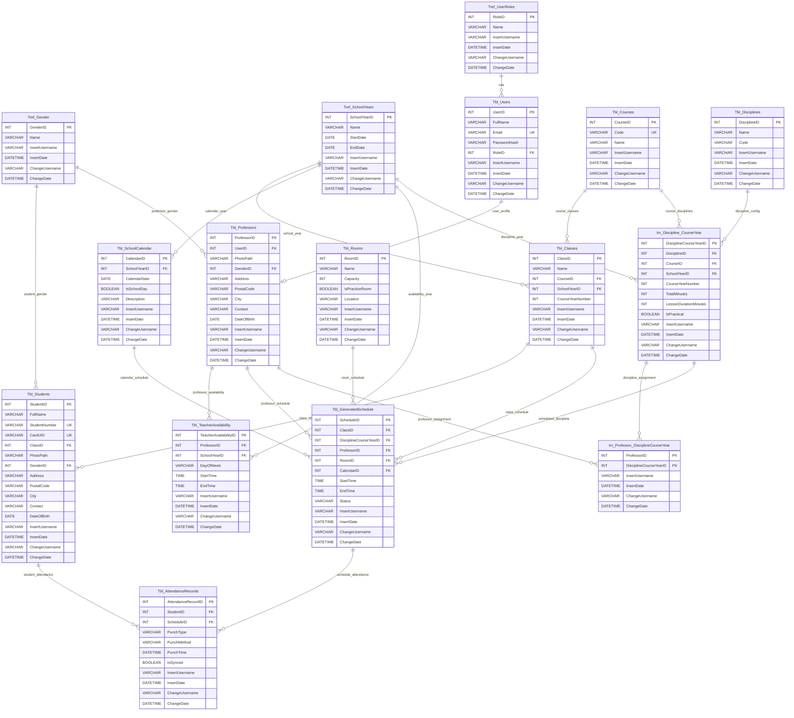

# Academia360 ER Diagram and Relational Model

This document describes the relational model of the Academia360 database.

The database uses three table prefixes:

| Prefix | Meaning | Example |
|---|---|---|
| `Tbl_` | Main data table | `Tbl_Students` |
| `Tref_` | Reference table / fixed list | `Tref_UserRoles` |
| `trx_` | Relationship table | `trx_Discipline_CourseYear` |

---

## 1. Relational Model

---

## Reference Tables

### `Tref_UserRoles`

```text
Tref_UserRoles
---------------
RoleID PK
Name
InsertUsername
InsertDate
ChangeUsername
ChangeDate
```

Stores the available roles in the system.

Example values:

```text
admin
director
secretary
professor
```

---

### `Tref_Gender`

```text
Tref_Gender
------------
GenderID PK
Name
InsertUsername
InsertDate
ChangeUsername
ChangeDate
```

Stores gender reference values.

Example values:

```text
Male
Female
Other
```

---

### `Tref_SchoolYears`

```text
Tref_SchoolYears
----------------
SchoolYearID PK
Name
StartDate
EndDate
InsertUsername
InsertDate
ChangeUsername
ChangeDate
```

Stores the school years used by classes, calendar records, teacher availability and discipline workload configurations.

Example values:

```text
2025/2026
2026/2027
```

---

## Main Data Tables

### `Tbl_Users`

```text
Tbl_Users
---------
UserID PK
FullName
Email UNIQUE
PasswordHash
RoleID FK -> Tref_UserRoles.RoleID
InsertUsername
InsertDate
ChangeUsername
ChangeDate
```

Stores users who can authenticate into the system.

The user role is linked through `RoleID`.

---

### `Tbl_Courses`

```text
Tbl_Courses
-----------
CourseID PK
Code UNIQUE
Name
InsertUsername
InsertDate
ChangeUsername
ChangeDate
```

Stores the general training programmes.

Example values:

```text
TGEI
TGPSI
TCIB
```

---

### `Tbl_Classes`

```text
Tbl_Classes
-----------
ClassID PK
Name
CourseID FK -> Tbl_Courses.CourseID
SchoolYearID FK -> Tref_SchoolYears.SchoolYearID
CourseYearNumber
InsertUsername
InsertDate
ChangeUsername
ChangeDate
```

Stores student groups inside a course and school year.

Example:

```text
TGEI 1A
Course: TGEI
School year: 2025/2026
Course year number: 1
```

---

### `Tbl_Students`

```text
Tbl_Students
------------
StudentID PK
FullName
StudentNumber UNIQUE
CardUID UNIQUE
ClassID FK -> Tbl_Classes.ClassID
PhotoPath
GenderID FK -> Tref_Gender.GenderID
Address
PostalCode
City
Contact
DateOfBirth
InsertUsername
InsertDate
ChangeUsername
ChangeDate
```

Stores student information.

Students are assigned to a class through `ClassID`.

---

### `Tbl_Professors`

```text
Tbl_Professors
--------------
ProfessorID PK
UserID FK -> Tbl_Users.UserID
PhotoPath
GenderID FK -> Tref_Gender.GenderID
Address
PostalCode
City
Contact
DateOfBirth
InsertUsername
InsertDate
ChangeUsername
ChangeDate
```

Stores professor-specific information.

Important:

```text
Professor name and email are not stored here.
They come from Tbl_Users.
```

This avoids duplicating name and email in both `Tbl_Users` and `Tbl_Professors`.

---

### `Tbl_Disciplines`

```text
Tbl_Disciplines
---------------
DisciplineID PK
Name
Code
InsertUsername
InsertDate
ChangeUsername
ChangeDate
```

Stores the general catalogue of disciplines.

Example values:

```text
Programming
Networks
Databases
Operating Systems
Mathematics
```

Important:

```text
This table does not store total hours, lesson duration or practical flag.
Those values are stored in trx_Discipline_CourseYear.
```

---

### `Tbl_Rooms`

```text
Tbl_Rooms
---------
RoomID PK
Name
Capacity
IsPracticeRoom
Location
InsertUsername
InsertDate
ChangeUsername
ChangeDate
```

Stores rooms used for schedule records.

`IsPracticeRoom` indicates whether the room can be used for practical disciplines.

---

### `Tbl_SchoolCalendar`

```text
Tbl_SchoolCalendar
------------------
CalendarID PK
SchoolYearID FK -> Tref_SchoolYears.SchoolYearID
CalendarDate UNIQUE
IsSchoolDay
Description
InsertUsername
InsertDate
ChangeUsername
ChangeDate
```

Stores school calendar dates.

This table allows the system to know if a date is a school day or not.

---

### `Tbl_TeacherAvailability`

```text
Tbl_TeacherAvailability
-----------------------
TeacherAvailabilityID PK
ProfessorID FK -> Tbl_Professors.ProfessorID
SchoolYearID FK -> Tref_SchoolYears.SchoolYearID
DayOfWeek
StartTime
EndTime
InsertUsername
InsertDate
ChangeUsername
ChangeDate
```

Stores professor availability by school year.

Allowed `DayOfWeek` values:

```text
monday
tuesday
wednesday
thursday
friday
```

---

### `Tbl_GeneratedSchedule`

```text
Tbl_GeneratedSchedule
---------------------
ScheduleID PK
ClassID FK -> Tbl_Classes.ClassID
DisciplineCourseYearID FK -> trx_Discipline_CourseYear.DisciplineCourseYearID
ProfessorID FK -> Tbl_Professors.ProfessorID
RoomID FK -> Tbl_Rooms.RoomID
CalendarID FK -> Tbl_SchoolCalendar.CalendarID
StartTime
EndTime
Status
InsertUsername
InsertDate
ChangeUsername
ChangeDate
```

Stores generated or manually created schedule records.

Important:

```text
The schedule does not point directly to Tbl_Disciplines.
It points to trx_Discipline_CourseYear.
```

This allows the schedule to know the exact course, school year, course year number, workload and practical configuration of the discipline.

Allowed `Status` values:

```text
draft
approved
cancelled
```

---

### `Tbl_AttendanceRecords`

```text
Tbl_AttendanceRecords
---------------------
AttendanceRecordID PK
StudentID FK -> Tbl_Students.StudentID
ScheduleID FK -> Tbl_GeneratedSchedule.ScheduleID
PunchType
PunchMethod
PunchTime
IsSynced
InsertUsername
InsertDate
ChangeUsername
ChangeDate
```

Stores student attendance punches.

Allowed `PunchType` values:

```text
in
out
```

Allowed `PunchMethod` values:

```text
nfc
rfid
qr
barcode
manual
```

---

## Relationship Tables

### `trx_Discipline_CourseYear`

```text
trx_Discipline_CourseYear
-------------------------
DisciplineCourseYearID PK
DisciplineID FK -> Tbl_Disciplines.DisciplineID
CourseID FK -> Tbl_Courses.CourseID
SchoolYearID FK -> Tref_SchoolYears.SchoolYearID
CourseYearNumber
TotalMinutes
LessonDurationMinutes
IsPractical
InsertUsername
InsertDate
ChangeUsername
ChangeDate
```

Stores the workload configuration of a discipline for a specific course and school year.

Example:

```text
Programming
Course: TGEI
School year: 2025/2026
Course year number: 1
Total minutes: 7200
Lesson duration: 60
Practical: true
```

This table exists because the same discipline can have different workloads depending on the course and school year.

---

### `trx_Professor_DisciplineCourseYear`

```text
trx_Professor_DisciplineCourseYear
----------------------------------
ProfessorID PK FK -> Tbl_Professors.ProfessorID
DisciplineCourseYearID PK FK -> trx_Discipline_CourseYear.DisciplineCourseYearID
InsertUsername
InsertDate
ChangeUsername
ChangeDate
```

Assigns professors to specific discipline-course-year records.

This is more precise than only saying:

```text
Professor teaches Programming
```

The new model says:

```text
Professor teaches Programming for TGEI in 2025/2026, Year 1
```

---

## 2. Main Relationships

```text
Tref_UserRoles.RoleID
    1 ─── N Tbl_Users.RoleID

Tbl_Users.UserID
    1 ─── 0..1 Tbl_Professors.UserID

Tref_Gender.GenderID
    1 ─── N Tbl_Students.GenderID

Tref_Gender.GenderID
    1 ─── N Tbl_Professors.GenderID

Tref_SchoolYears.SchoolYearID
    1 ─── N Tbl_Classes.SchoolYearID

Tref_SchoolYears.SchoolYearID
    1 ─── N Tbl_SchoolCalendar.SchoolYearID

Tref_SchoolYears.SchoolYearID
    1 ─── N Tbl_TeacherAvailability.SchoolYearID

Tref_SchoolYears.SchoolYearID
    1 ─── N trx_Discipline_CourseYear.SchoolYearID

Tbl_Courses.CourseID
    1 ─── N Tbl_Classes.CourseID

Tbl_Courses.CourseID
    1 ─── N trx_Discipline_CourseYear.CourseID

Tbl_Classes.ClassID
    1 ─── N Tbl_Students.ClassID

Tbl_Classes.ClassID
    1 ─── N Tbl_GeneratedSchedule.ClassID

Tbl_Disciplines.DisciplineID
    1 ─── N trx_Discipline_CourseYear.DisciplineID

Tbl_Professors.ProfessorID
    1 ─── N Tbl_TeacherAvailability.ProfessorID

Tbl_Professors.ProfessorID
    1 ─── N Tbl_GeneratedSchedule.ProfessorID

Tbl_Professors.ProfessorID
    1 ─── N trx_Professor_DisciplineCourseYear.ProfessorID

trx_Discipline_CourseYear.DisciplineCourseYearID
    1 ─── N trx_Professor_DisciplineCourseYear.DisciplineCourseYearID

trx_Discipline_CourseYear.DisciplineCourseYearID
    1 ─── N Tbl_GeneratedSchedule.DisciplineCourseYearID

Tbl_Rooms.RoomID
    1 ─── N Tbl_GeneratedSchedule.RoomID

Tbl_SchoolCalendar.CalendarID
    1 ─── N Tbl_GeneratedSchedule.CalendarID

Tbl_GeneratedSchedule.ScheduleID
    1 ─── N Tbl_AttendanceRecords.ScheduleID

Tbl_Students.StudentID
    1 ─── N Tbl_AttendanceRecords.StudentID
```

---

## 3. Simplified Relationship Diagram

```text
Tref_UserRoles
    └── Tbl_Users
            └── Tbl_Professors
                    ├── Tbl_TeacherAvailability
                    ├── Tbl_GeneratedSchedule
                    └── trx_Professor_DisciplineCourseYear

Tref_Gender
    ├── Tbl_Students
    └── Tbl_Professors

Tref_SchoolYears
    ├── Tbl_Classes
    ├── Tbl_SchoolCalendar
    ├── Tbl_TeacherAvailability
    └── trx_Discipline_CourseYear

Tbl_Courses
    ├── Tbl_Classes
    └── trx_Discipline_CourseYear

Tbl_Classes
    ├── Tbl_Students
    └── Tbl_GeneratedSchedule

Tbl_Disciplines
    └── trx_Discipline_CourseYear
            ├── Tbl_GeneratedSchedule
            └── trx_Professor_DisciplineCourseYear

Tbl_Rooms
    └── Tbl_GeneratedSchedule

Tbl_SchoolCalendar
    └── Tbl_GeneratedSchedule

Tbl_GeneratedSchedule
    └── Tbl_AttendanceRecords

Tbl_Students
    └── Tbl_AttendanceRecords
```

---

## 4. Mermaid ER Diagram With Columns

This diagram includes columns inside each table.



---

## 5. Core Design Decisions

### Users and Professors Are Separated

`Tbl_Users` stores login and identity information:

```text
FullName
Email
PasswordHash
RoleID
```

`Tbl_Professors` stores professor-specific information:

```text
UserID
PhotoPath
GenderID
Address
PostalCode
City
Contact
DateOfBirth
```

This avoids duplicating the professor name and email.

---

### Courses and Classes Are Separated

A course represents the general training programme.

A class represents a specific group of students in a course and school year.

Example:

```text
Course: TGEI
Class: TGEI 1A
School year: 2025/2026
Course year number: 1
```

---

### Disciplines and Workload Are Separated

`Tbl_Disciplines` stores only the general discipline catalogue.

`trx_Discipline_CourseYear` stores the workload configuration.

This is necessary because the same discipline can have different workloads depending on the course and school year.

Example:

```text
Programming in TGEI Year 1 may have 7200 minutes.
Programming in TGPSI Year 1 may have 8400 minutes.
```

---

### Schedule Uses `DisciplineCourseYearID`

`Tbl_GeneratedSchedule` does not reference `Tbl_Disciplines` directly.

It references `trx_Discipline_CourseYear`.

This makes the schedule more precise because it knows:

- The discipline
- The course
- The school year
- The course year number
- The workload
- Whether the discipline is practical or not

---

### Schedule Uses `CalendarID`

`Tbl_GeneratedSchedule` references `Tbl_SchoolCalendar`.

This allows the backend to validate whether a date is a school day before creating a schedule record.

---

## 6. Schedule Validation Rules

Before creating or updating a schedule record, the backend validates:

- The class exists.
- The discipline course year record exists.
- The professor exists.
- The room exists.
- The calendar date exists.
- The calendar date is a school day.
- The class course matches the discipline course.
- The class school year matches the discipline school year.
- The class course year number matches the discipline course year number.
- The professor is assigned to the selected discipline course year.
- Practical disciplines are scheduled in practice rooms.
- A class cannot have overlapping lessons.
- A professor cannot have overlapping lessons.
- A room cannot have overlapping lessons.

---

## 7. Final Summary

The current model supports:

- Role-based users
- Professors linked to users
- Students linked to classes
- Classes linked to courses and school years
- Disciplines separated from workload configuration
- Professors assigned to specific discipline-course-year records
- Rooms with practical-room support
- School calendar with school-day validation
- Teacher availability by school year
- Schedule records with conflict validation
- Attendance records linked to students and schedules

This structure provides a solid foundation for the next major step: automatic schedule generation.